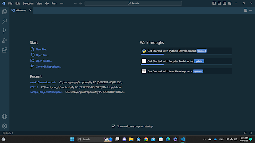
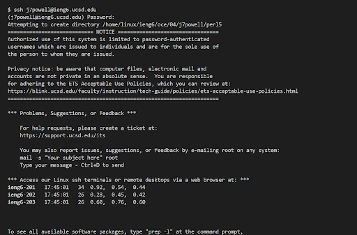
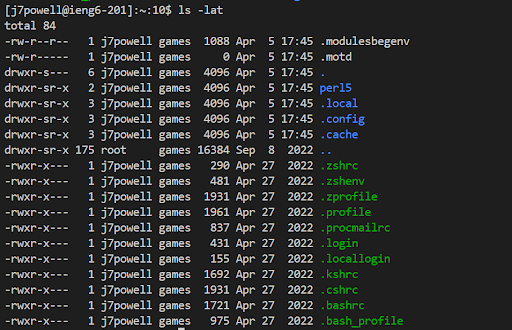

# How to log into a course specific account on ieng6
---
##  Step 1 install VS Code:
---
In order to connect remotely you will need VS Code installed. There are many video guides on how to install and set up VS code. If you have met the prerequisites for this course you will more than likely already have VS code installed.
Once Installed you should see this:
---

---
## Step 2 Connect Remotely:
---
Now that you have VS Code installed you will be installing bash to use within VS code. If you are on Windows like I am you will use this [Link](https://gitforwindows.org/). If you have not used bash previously follow this [Link](https://stackoverflow.com/a/50527994). From here you will open your terminal and enter $ ssh cs15lsp23zz@ieng6.ucsd.edu with the zz being your own unique ID. After following the prompt you should be met with a screen similar to this:

---
## __Step 3 Getting Familiar:__
---
In order to get familar you should try running some commands such as cd, ls , pwd,mkdir, etc to see how the terminal reacts. For example I used the command ls -lat and recieved this:
---

